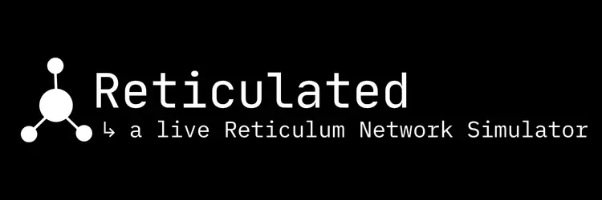
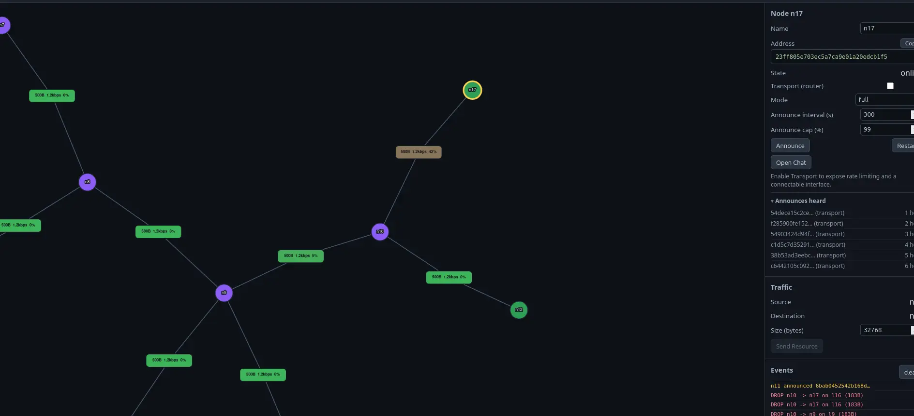

## Reticulated



Reticulated is a Reticulum Network simulator that spawns live, interactive Reticulum instances controllable from a node-based Web UI. 

You can create networks of any topology and set bitrate, MTU, and configure path loss and propagation behavior. It provides a top-down view to a live network. You can connect any Reticulum application to the simulated network. It also has built in utilities like a basic LXMF chat function and Resource transfer included.




### Requirements

- Python 3.10+
- `rnsd`, `rnstatus`, `rnpath` on `PATH` (installed with the `rns` package)

## Install and run

```bash
pip install -r requirements.txt
python run.py
```

Open http://127.0.0.1:8000.

```bash
python run.py --port 9000                 # web UI on 9000
python run.py --host 0.0.0.0 --port 9000  # listen on all interfaces
python run.py --hub-port 5900             # move the medium hub off 5800
SIM_PORT=9000 SIM_HUB_PORT=5900 python run.py
```

Each node's `instance_name` is derived from the data directory under simdata/

